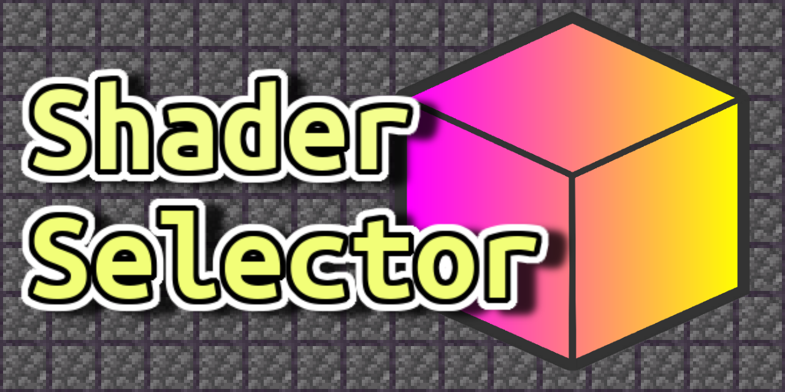
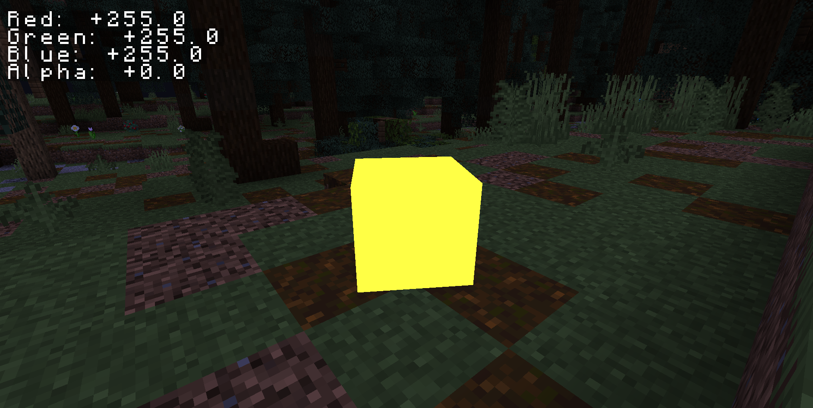
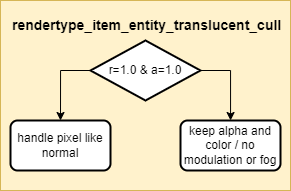

# Shader Selector (Minecraft Resource Pack)
<!-- ALL-CONTRIBUTORS-BADGE:START - Do not remove or modify this section -->

<!-- ALL-CONTRIBUTORS-BADGE:END -->

## How it Works! 🔨
<!-- prettier-ignore-start -->
<!-- markdownlint-disable -->

1. 3D Models of cubes of specific colors (R=255,G=X,B=Y,A=255) are used as inputs.

2. A core shader ensures that the models have the same color on all sides, bypassing default color modulation.
<!-- markdownlint-enable -->
<!-- prettier-ignore-end -->

## Contributors 🧱
<!-- prettier-ignore-start -->
<!-- markdownlint-disable -->
<table>
  <tr>
    <td align="center"><a href="https://github.com/CloudWolfYT"> <b>Cloud Wolf</b></a> <a href="#" title="Project Creator">🔨</a></td>
    <td align="center"><a href=""> <b>The Der Discohund</b></a> <a href="#" title="Theory Contributor">💡</a></td>
    <td align="center"><a href=""> <b>RitikShah</b></a> <a href="#" title="Theory Contributor">💡</a></td>
  </tr>
</table>

<!-- markdownlint-enable -->
<!-- prettier-ignore-end -->
